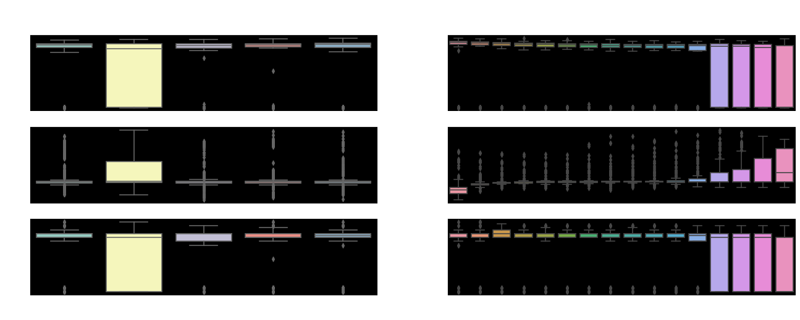

# cbm-timeseries

## Description
A project to analyze time series data from vibration and temperature sensors. The idea is to do an exploration of the data and the visualize it.  
It is further completed with some forecasting  
There is also a dash app built within to visualize all results for the non-programmer.

## Usage
exploration.ipynb is an early data exploration of temperature,acceleration
acceleration.ipynb is a more thorough exploration of the data including forecasting at the end
run app.py is the Dash application which feeds from utils and currently acceleration.csv

## Roadmap

- [x] Exploration completed
- [x] Forecasting done for the next 30 days to the dataset
- [ ] Complete a web browser application to use by none programmers
- [ ] Connect to the source database (Influxdb in this case)

## Authors and acknowledgment
José María Sabater

## License
Open for Scania

## Project status
Work in progress
